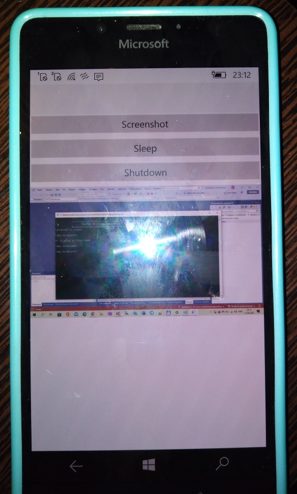

# ProjectRome (codename)

This is my fork of some old sweet "TCP-IP-Server-Sample" project.
My goal is to make alternative of famous (and completely stopped by) MS "ProjectRome".

## Screenshots

## Steps of my RnD plan 

Step 1. TCP IP "service message bus"

Step 2. OneDrive / Microsoft Graph "service bus"

Step 3 (optional). Hybrid methods of "near fields" / "cloud mode" (dynamic switch between SignalR / Firebase DB / MEGA.NZ / maybe something else)))

## Current scenario

The purpose of this project (step 1) is to develop Android based application which will serve the Administrator with on demand remote surveillance and controlling of work stations of work place. This project will involve the development of two applications, one will run on work stations and the other one will run on the mobile phone of the Administrator. 
Both these applications will be connected through Wi-Fi. The implementation of such mechanism will make the Administrator not only to have an eye on the activities of users but also will make him able to remotely control the specific work station(s).
 

## Solution structure 

Server - .NET 4.8 Console App 

XF Client - W10M UWP App (ready), and Android + iOS "app templates" (not needed to me)

Client - Mono Android App

## .

AS IS. No support. RnD only.

## ..

[m][e] 2022

