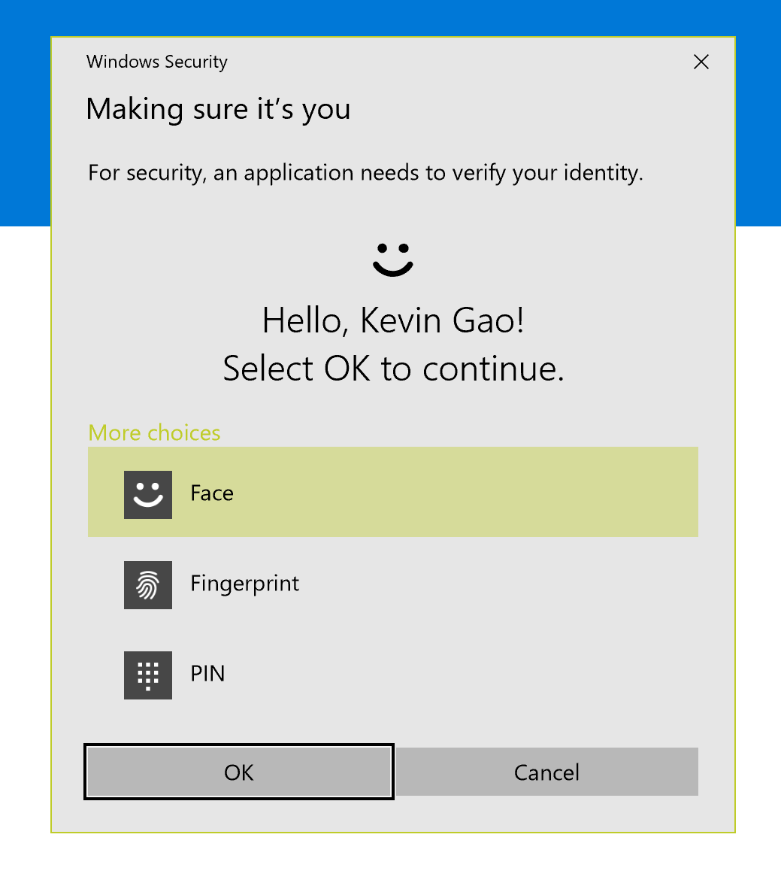

# ProjectHome (Alt.ProjectHome codename)

Project Home is planned as some cross-platform project (Desktop + UWP or Xamarin Forms... idk). 

With Project Home, you can shutdown your computer remotely even if your two devices (computer/mobile phone/notebuuk/laptop, etc.) are not on the same local network. ;)

My ProjectHome solution is based on Project RET.

## What is RET?

RET refers to **Re**mote Shu**t**down. Or [Re]mote reboo[T] :)

## Implementation

We used the APIs of Project Rome provided by Microsoft so that we could reach any devices remotely as long as these devices signed into the same Microsoft Account. The APIs in Project Rome enabled the cross-platform application engagement, and they are easy to call on any platform.

However, to achieve remote control, we still need a client on the controlled device. The client registered a URL protocol which accept specified data as parameters and allows remote calls. Correspondingly, the client on the controller side will send the URL launching request through the Project Rome APIs and provide some keys for authentication.

## Security

Since the client will expose a URL protocol publicly, there might be some security risks, we use a security key and device GUID as credentials to prevent your devices from attack.

As for the controller side, we used Windows Hello for authentication. Before enter the controller console, user must enter there PIN or login with fingerprint or facial recognition :

## User guide

### Install client on controlled side

Install the Project Ret client.

You can see a 8-character key on the "popup" window.

### Install and configure the controller client

Find the device name of the device you want to control and tap the "Setup" button.

Enter the 8-character key (case sensitive).

## Referencies

https://github.com/gaojunxuan/ProjectRet.Desktop

https://github.com/gaojunxuan/ProjectRet.UWP

https://github.com/microsoft/ProjectHome